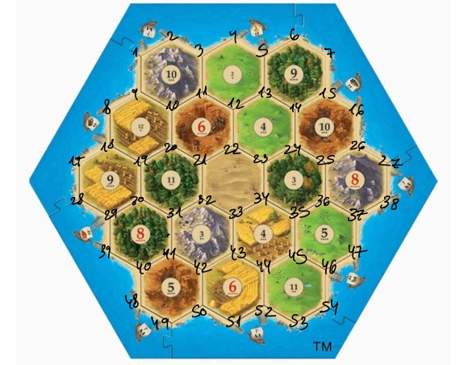

# Excpp_3
//ID: 208018028, Mail: ronimordechai70@gmail.com
# Catan Game Project

Welcome to the Catan Game Project, a C++ implementation of the popular board game "Catan". This README provides a comprehensive guide to the project, explaining its structure, components, key gameplay features, and usage instructions.

## Table of Contents
- [Project Overview](#project-overview)
- [Installation](#installation)
- [Usage](#usage)
- [Core Components](#core-components)
- [Important Notes](#important-notes)
- [Summery](#summery)

## Project Overview
The Catan Game Project is designed to simulate the classic game "Catan". The project consists of multiple components, including core game classes, a demo, and test cases. The main files include `Catan.cpp`, `Board.cpp`, `Player.cpp`, `DevelopmentCard.cpp`, `Settlement.cpp`, `City.cpp`, `Tile.cpp`, and `Resource.hpp`.

### Core Files:
- **Catan.cpp**: Manages the overall game logic and flow.
- **Board.cpp**: Represents the game board, built from tiles, each having a number and points.
- **Player.cpp**: Manages player actions, resources, and points.
- **DevelopmentCard.cpp**: Implements development cards using inheritance.
- **Settlement.cpp**: Represents player settlements.
- **City.cpp**: Represents player cities.
- **Tile.cpp**: Represents individual tiles on the board.
- **Resource.hpp**: Defines the resource types.

Additional files:
- **Demo.cpp**: Demonstrates the game functionality.
- **Test.cpp**: Contains test cases for validating game logic.
- **Makefile**: Facilitates the building and compilation of the project.
  - **Note on Makefile**: When running the `make tidy` command, warnings about magic numbers in the matrices in the demo and tests are expected and acceptable. Additionally, Valgrind is not installed correctly on my computer, so `make valgrind` does not work. However, there is no need for concern about memory leaks as there is no dynamic allocation.

## Installation
To set up the project, you need a g++ compiler and build tools. The `Makefile` can be used to compile the project.

# Run the Makefile
make catan

## Usage
After compiling the project by make catan, you can run the demo to see the implemented function in the game. 

# Run the demo
./demo

The main is discribe one roand of the game.

# Run the main
./main 

The test cases in Test.cpp and TestCounter.cpp validate the project's behavior against edge cases and other scenarios. To run the tests, use:

# Run the test
./test

## Core Components
class:
1. catan.cpp
Manages overall game logic and flow, including player turns, resource allocation, and game progression.

2. board.cpp
Defines the game board, which is built from tiles. Each tile has a number and points. The board configuration does not change during the game.

3. player.cpp
Manages player actions, resources, and points. It includes methods for placing settlements and cities, rolling dice, trading resources, and buying development cards.

4. development_card.cpp
Implements development cards using inheritance, providing various effects and abilities to players.

5. settlement.cpp
Represents player settlements on the board.

6. city.cpp
Represents player cities on the board.

7. tile.cpp
Represents individual tiles on the board, each with a number and associated resources.

8. resource.hpp
Defines the resource types available in the game.

## Important Notes

- The game supports up to 3 players.
- The game does not include the robber.
- The game does not have the "Longest Road" feature as in the real game.

## Summary

This project focuses on implementing the Catan game in C++, including core game mechanics such as player actions, board management, and resource allocation. It includes a demo for showcasing gameplay and test cases for validating functionality. The game supports up to 3 players and provides a simplified version of the classic Catan experience.

Enjoy playing and exploring the Catan Game Project!

 

